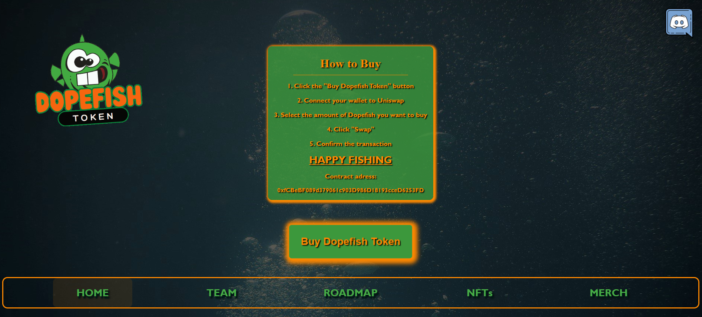

# School project

Group work, with the help of agile methods we developed a meme token called Dopefish(DOPE)

Our token is inspired and named after the game character Dopefish. We tried out React and Solidity for the development of our project. Our token has now been launched on the Goerli testnet network and is now available for trade on uniswap.

